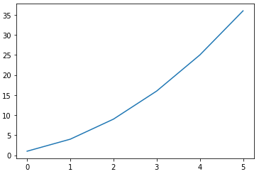
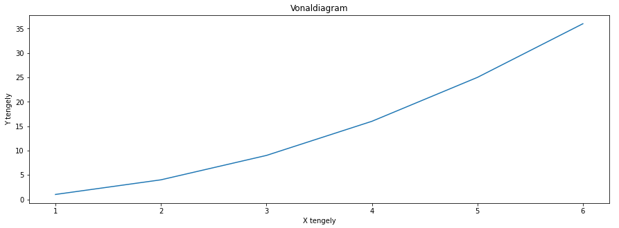
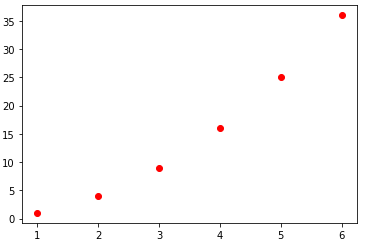
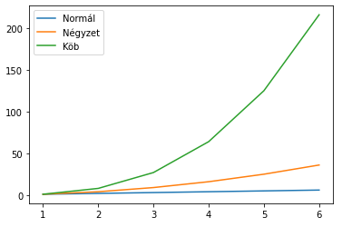
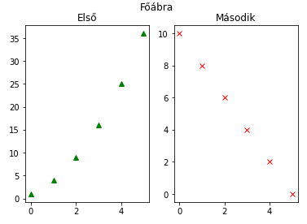
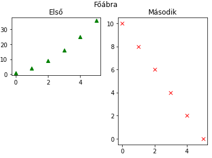
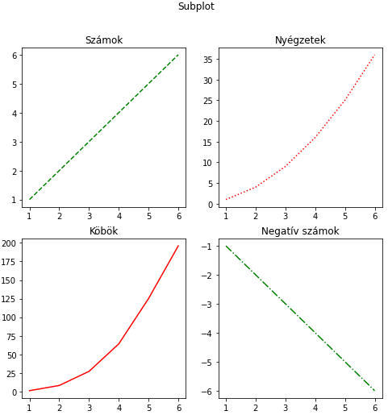
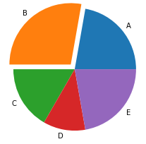
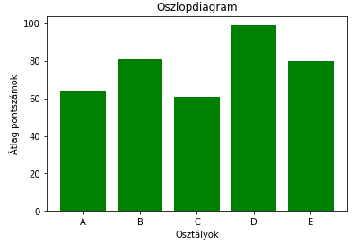
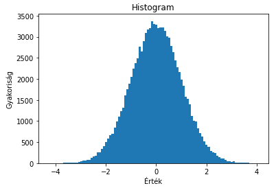

# Adatvizualizáció
A nagy adatsorok elemzése során nehéz megtalálni a lényeges információkat. Az adatok megfelelő formában történő megjelenítésével azonban pillanatok alatt láthatóvá válnak a kiugró értékek, trendek vagy egyéb releváns mutatók.

A `matplotlib` egyike a számos adatvizualizációra alkalmas Python modulnak. Kiválóan alkalmas statikus, animált vagy éppen interaktív ábrák és grafikonok megjelenítésére. A kevés előfeltétele (más modulok) miatt előszeretettel alkalmazzák egyszerűbb projektekben. Bár rendkívül széles az eszközkészlete, komolyabb adatelemzéshez inkább komplexebb modulokat érdemes alkalmazni. De látni fogjuk, hogy a legtöbb feladatra a `matplotlib` is bőven elegendő.

Telepíteni a szokásos `pip` utasítással lehet:
```python
pip install matplotlib
```
Ebben az anyagban csak a modul leggyakrabban használt funkcióit mutatjuk be a teljesség igénye nélkül. A bővebb, hivatalos leírás elérhető az alábbi linken: [Python Matplotlib Guide](https://realpython.com/python-matplotlib-guide).

## Vonaldiagram
A `matplotlib.pyplot` osztály `plot` metódusával vonaldiagramon ábrázolhatók a megadott értékek.
```python
import matplotlib.pyplot as plt

y = [1, 4, 9, 16, 25, 36]
plt.plot(y)
```


Alapértelmezetten a nullától induló x tengelyen jelennek meg az értékek, de egy, az értékekkel megegyező méretű listával megadhatók az x tengely megfelelő értékei is. 

```python
import matplotlib.pyplot as plt

x = [1, 2, 3, 4, 5, 6]
y = [1, 4, 9, 16, 25, 36]
plt.plot(x, y)
```
Az x tengely értékeinek nem kell folytonosnak lennie, és a növekvő sorrend sem elvárás, de a pontok összekötése az x tengely értékei alapján kerülnek meghatározásra.

Számos lehetőség van az ábra formázására.
```python
import matplotlib.pyplot as plt

x = [1, 2, 3, 4, 5, 6]
y = [1, 4, 9, 16, 25, 36]

#Az ábra mérete inch-ben
plt.figure(figsize=(15, 5))
plt.plot(x, y)
# Ábra címe
plt.title('Vonaldiagram')

# X tengely felirata
plt.xlabel('X tengely')
# Y tengely felirata
plt.ylabel('Y tengely')
# Megjeleníti a definiált ábrákat
plt.show()
```

A példában az utolsó `show` függvény hívás nélkül is megjelenik az ábra. A fő funkciója az, hogy lezárja a formázást, mielőtt a következő ábra megjelenítésére térnénk rá. (A `show` ennél többet is csinál, de nekünk most ennyit elég róla tudni.) Az átméretezés magára a megjelenítési felületre vonatkozik, ezért ezt még a `plot` hívás előtt kell beállítani, különben nem jut érvényre.

A `plot` függvény harmadik paraméterének a neve `fmt` azaz "format". A segítségével egy rövid karakterkóddal megadhatjuk a vonaldiagram megjelenését. Például elhagyhatjuk az összekötő vonalakat és a pontokat piros körökre cserélhetjük az "ro" argumentummal.
```python
import matplotlib.pyplot as plt

x = [1, 2, 3, 4, 5, 6]
y = [1, 4, 9, 16, 25, 36]

plt.plot(x, y, "ro")
plt.show()
```


Az `fmt` paraméter leírása [ezen](https://matplotlib.org/stable/api/_as_gen/matplotlib.pyplot.plot.html) az oldalon a *Notes* szekció alatt érhető el.

## Több adatsor
Több adatsor megjelenítéséhez egyszerűen újra meg kell hívni a `plot` függvényt az ábra lezárása (`show`) nélkül.
```python
import matplotlib.pyplot as plt
import numpy as np

x = np.arange(1, 7)

plt.plot(x, x, label="Normál")
plt.plot(x, x**2, label="Négyzet")
plt.plot(x, x**3, label="Köb")

plt.legend()

plt.show()
```


A példában a NumPy modul segítségével hoztunk létre egy kiinduló vektort, és ebből a hatványozás segítségével állítottuk elő az adatsorokat. (Ez hagyományos Python lista esetén nem működne.)

Egy további újdonság, hogy `label` nevű paraméterrel elneveztük az egyes adatsorokat, a jelmagyarázatot, pedig a `legend` segítségével jelenítettük meg. A `legend` lehetséges beállításairól az [online útmutatóból](https://matplotlib.org/stable/api/_as_gen/matplotlib.pyplot.legend.html) lehet tájékozódni.

## Subplot
Gyakran előfordul, hogy hely szűkében vagyunk vagy könnyen összehasonlítható grafikonokra van szükségünk. Ilyenkor egy ábrára több grafikont is szeretnénk elhelyezni. Az alábrák (`subplot`) lehetőséget adnak erre. 
```python
import matplotlib.pyplot as plt

plt.subplot(1, 2, 1)
plt.plot([1, 4, 9, 16, 25, 36], "g^")
plt.title("Első")

plt.subplot(1, 2, 2)
plt.plot([10, 8, 6, 4, 2, 0], "rx")
plt.title("Második")

plt.suptitle("Főábra")
plt.show()
```


A `subplot` függvény létrehoz egy felületet, amire a következő `plot`-ot elhelyezhetjük.  A `subplot` első két paramétere egy mátrixot határoz meg (sor és oszlopszám), amiben el lehet helyezni az aktuális ábrát. A harmadik paraméter azt mondja meg, hogy a mátrixon belül melyik indexű helyre kerüljön az ábránk. A számozás 1-től indul és balról jobbra, soronként haladva növekszik. A példában a `plt.subplot(1, 2, 2)` egy egysoros és két oszlopos elrendezés jobb oldali részét jelöli ki.

A funkció használata során általában oda kell figyelni, hogy mindig egyforma méretű mátrixot adjunk meg (egészen addig, míg egy `show` utasítással le nem zártuk az adott ábrát). Lehetőség van azonban arra is, hogy egynél több indexet összevonjunk egy nagyobb `subplot`-ba. Ebben az esetben eltérő méretű, de az eredetinek megfelelő elrendezésű mátrix segítségével nagyobb alábrákat is létrehozhatunk.
```python
import matplotlib.pyplot as plt

plt.subplot(2, 2, 1)
plt.plot([1, 4, 9, 16, 25, 36], "g^")
plt.title("Első")

plt.subplot(1, 2, 2)
plt.plot([10, 8, 6, 4, 2, 0], "rx")
plt.title("Második")

plt.suptitle("Főábra")
plt.show()
```


Ebben a példában az előzőhöz képest csak az első `subplot` első paraméterét módosítottuk 1-ről 2-re. Így egy 2x2-es mátrix első helyére próbáltuk meg elhelyezni az első ábrát. A második ábra egy 1x2-es mátrix második helyére kerülne, ami megfelel az eredeti 2x2-es mátrix 2. és 4. helyének. Utóbbiak még üresek az eredeti mátrixban, ezért elhelyezhető oda a nagyobb ábra. A példában az is jól látszik, hogy akár üresen is hagyhatunk helyeket az ábrán.

Számos olyan elrendezést lehet találni, amit a fenti megoldással nem lehet előállítani. Ezekhez már a `matplotlib` [`gridspec`](https://matplotlib.org/stable/tutorials/intermediate/gridspec.html) osztályát kell használni. Ilyen komplex ábrákat a gyakorlatok során nem kell majd előállítani.

Amennyiben sok alábrával vagy ábrával dolgozunk, zavaró lehet, hogy a kódban egy helyen kell szerepelnie az egyes `plot`-okhoz. Gyakran jobb, ha például az egyes ábra feliratokat egy helyen tudjuk kezelni. Ehhez szükség van arra, hogy a kódban később is hivatkozni tudjunk az egyes ábráinkra.
```python
import matplotlib.pyplot as plt

x = [1, 2, 3, 4, 5, 6]
y = [[1, 2, 3, 4, 5, 6],
     [1, 4, 9, 16, 25, 36],
     [1, 8, 27, 64, 125, 196],
     [-1, -2, -3, -4, -5, -6]]

fig = plt.figure(figsize=(8, 8))

ax_1 = fig.add_subplot(2, 2, 1)
ax_1.plot(x, y[0], "g--")

ax_2 = fig.add_subplot(2, 2, 2)
ax_2.plot(x, y[1], "r:")

ax_3 = fig.add_subplot(2, 2, 3)
ax_3.plot(x, y[2], "r-")

ax_4 = fig.add_subplot(2, 2, 4)
ax_4.plot(x, y[3], "g-.")

ax_1.set_title("Számok")
ax_2.set_title("Nyégzetek")
ax_3.set_title("Köbök")
ax_4.set_title("Negatív számok")
fig.suptitle("Subplot")

plt.show()
```


Az ábra méretét meghatározó függvény visszatérési értéke egy `Figure` objektum. A `pyplot` segítségével közvetlenül hívott utasítások (pl.: `plt.suptitle`) a háttérben gyakran az éppen aktuális `Figure` objektum megfelelő metódusait hívják meg. Amennyiben ezt lementjük egy változóba, később közvetlenül is elérhetjük.

> Érdekesség: Ha egy visszatérési értékkel rendelkező függvény eredményét nem mentjük változóba vagy használjuk fel, akkor azt a Python automatikusan kiírja az `Output`-ra, kivéve akkor, ha egyébként `print`-el jelenítünk meg eredményt. Ezért, ha a `Figure`-t nem tesszük változóba, futtatáskor megjelenik egy az osztálypéldányt jelölő sor a kimeneten. Ha szebb megjelenítés érdekében ezt el akarjuk kerülni, akkor érdemes az ilyen függvények eredményét akkor is változóba tenni, ha nem tervezzük később használni.

A `plt` hívás helyett, közvetlenül a `Figure`-höz is adhatunk `subplot`-ot, de ilyenkor az `add_suplot` függvényt kell használni (a háttérben ez ugyanazt a kódot hívja, mint a `plt.subplot`). Mindegyik megoldás esetén a visszatérési érték egy `Axes` objektum (pontosabban az `Axes`-ből származó `AxesSubPlot`). 

Az `Axes` objektumokat változóba mentve közvetlenül rajzolhatunk rájuk (`plot`) és a megfelelő függvényhívásokkal bármikor beállíthatók a paramétereik. A legtöbb függvényük a `plt`-n keresztül történő hívással megegyezik, csak egy `set_` előtaggal kell kiegészíteni a függvény nevét.

A fenti példában az objektumok létrehozása jelentősen egyszerűsíthető a `plt.subplots` utasítás segítségével.

```python
import matplotlib.pyplot as plt

x = [1, 2, 3, 4, 5, 6]
y = [[1, 2, 3, 4, 5, 6],
     [1, 4, 9, 16, 25, 36],
     [1, 8, 27, 64, 125, 196],
     [-1, -2, -3, -4, -5, -6]]
fmt = ["g--", "r:", "r-", "g-."]

fig, ax = plt.subplots(2, 2, figsize=(8, 8))

c = 0
for i in range(2):
    for j in range(2):
        ax[i, j].plot(x, y[c], fmt[c])
        c += 1

ax[0, 0].set_title("Számok")
ax[0, 1].set_title("Nyégzetek")
ax[1, 0].set_title("Köbök")
ax[1, 1].set_title("Negatív számok")
fig.suptitle("Subplot")

plt.show()
```
A `plt.subplots` egyszerre több alábra helyét alakítja ki, és `tuple` visszatérési értékkel visszaadja a megfelelő `Figure` objektumot és egy a létrehozott `Axes` objektumokból álló tömböt. Innentől ciklus segítségével is kezelhető az egyes alábrák megjelenítése. (A fenti kódrészlet az előzővel teljesen megegyező ábrát eredményez.)

## Diagramtípusok
A `matplotlib` nem csak vonaldiagramok megjelenítésére alkalmas. A teljesség igénye nélkül nézzünk meg néhány másik típust.
### Kördiagram
A [kördiagram](https://matplotlib.org/stable/api/_as_gen/matplotlib.pyplot.pie.html) az eloszlások megjelenítésének legegyszerűbb formája.
```python
import matplotlib.pyplot as plt

cegek = ['A', 'B', 'C', 'D', 'E']
reszesedes = [20, 25, 15, 10, 20]
explode = [0, 0.1, 0, 0, 0]

pie = plt.pie(reszesedes, explode=explode, labels=cegek)
```


A létrehozáshoz szükséges a címkék és a kapcsolódó értékek listája. Az alapvető beállítások megtalálhatók online. Egy különleges lehetőség az `explode` nevesített paraméter, melynek segítségével a megfelelő elem (akár az összes) kiemelhető a körből, ezzel hangsúlyozva az értéket.

### Oszlopdiagram
Az [oszlopdiagram](https://matplotlib.org/stable/api/_as_gen/matplotlib.pyplot.bar.html) egy alapvető ábrázolási forma, de több adatsor kombinálásával viszonylag összetett ábrák előállítására is alkalmas.
```python
import matplotlib.pyplot as plt
import numpy as np

x = ['A', 'B', 'C', 'D', 'E']
y = list(np.random.randint(51, 100, size=5))

plt.bar(x, y, color="green")

plt.title("Oszlopdiagram")
plt.xlabel("Osztályok")
plt.ylabel("Átlag pontszámok")

plt.show()
```

A példában a NumPy csomag véletlen generátorát felhasználva, az 51-99 intervallumon generált véletlen értékeket jelenítettünk meg.

### Hisztogram
A [hisztogram](https://matplotlib.org/stable/api/_as_gen/matplotlib.pyplot.hist.html) az értelmezési tartományt egyforma méretű intervallumokra bontja, majd megszámolja az egyes intervallumokba eső értékeket, és az így kapott darabszámokat jeleníti meg egy "sűrű" oszlopdiagramon.
```python
import matplotlib.pyplot as plt
import numpy as np

# A Python lehetőséget ad arra, hogy alul vonással elválasztva olvashatóbbá tegyük a beégetett számértékeket.
# Az alábbi sorban az argumentum a 100000-es érték.
x = np.random.randn(100_000)

plt.title("Histogram")
plt.xlabel("Érték")
plt.ylabel("Gyakoriság")

plt.hist(x, 100)
plt.show()
```

A példában a NumPy `randn` függvényét felhasználva normális eloszlás mentén generáltunk 100.000 véletlen értéket. (A megszokott véletlen szám generátor egyenletes eloszlás mentén ad értékeket.) Jól látható, hogy a hisztogram kirajzolja a normális eloszlás görbéjét.

A `hist` függvény második paramétere (`bins`) adja meg, hogy hány intervallumra osztja fel a függvény az értelmezési tartományt. A paraméter elhagyható, alapértelmezett értéke 10.

## Feladatok
1. Jelenítsd meg egy vonaldiagramon a sinus függvény értékét az 1-20 tartományon!
2. Készíts egy 2x2 vonaldiagramból álló ábrát. Mindegyik x-tengelyen a számok 1-6-ig terjedjenek. Az értékek pedig rendre $x^2$, $x^3$, $x+2$ és $x+3$ legyenek. Minden alábrán más színű és megjelenésű vonal szerepeljen.
3. Hozz létre egy öt elemű vektort 1-100 közé eső véletlen értékekkel. Jelenítsd meg az értékeket egy kördiagramon, és emeld ki a legnagyobb értékkel rendelkező szeletet. (A legnagyobb érték indexét legkönnyebben a `numpy.argmax` függvénnyel találhatod meg.) A címkék legyenek az értékek sorszámai.
4. Jeleníts meg az előző feladatban szereplő kördiagramból kettőt (eltérő véletlen értékekkel) egymás mellett, alattuk pedig egy kétszer olyan széles alábrán egy oszlopdiagramot, amiben a két kör értékeinek összegei látszódjanak.
5. Jelenítsd meg egymás alatt a $sin(x)$ és $cos(x)$ függvényeket, valamint ezek 4-szeres frekvenciájú változatukat a $[0, \pi]$ intervallumon 0.1-es lépésközzel. Így összesen 4 alábrád lesz ugyanazon az értelmezési tartományon. Ezért legyen a teljes ábrának egy közös X tengely felirata, és minden alábra Y tengelyén pedig a függvény neve jelenjen meg.
6. Hozz létre egy függvényt, aminek a bemenete egy szám, és egy 5 elemű vektort ad eredményül, aminek az értékei 0 és a paraméter közti véletlen egész számok. A felhasználótól kérj be két egész számot (kezeld a hibákat), mindkét értékkel hívd meg a függvényt, és az eredményeket jelenítsd meg egy ábrán csoportosított oszlopdiagramként (5x2 oszlopnak kell látszódnia). Az oszlopok alapértelmezésben egybe esnek, ezért be kell állítani a diagram `width` tulajdonságát 0.5-nél kisebbre (pl.: 0.4), és az X tengely vektorát el kell tolni a `width` felével (az első diagramnál negatív, a másodiknál pozitív irányba).
7.  A korábbi hisztogram példát bővítsd ki úgy, hogy jelenjen meg rajta egy piros színű, a [normális eloszlást](https://hu.wikipedia.org/wiki/Norm%C3%A1lis_eloszl%C3%A1s) reprezentáló vonal. Ehhez normalizáld a hisztogramot (`density=True`), hozz létre egy vektort -4 és 4 között 0.1-es lépésközzel (ez lesz az értelmezési tartomány), majd számold ki a normális eloszlás értékét erre a tartományra ($m=0$, $\sigma=1$). Az így kapott eloszlásnak nagyjából illeszkednie kell a hisztogramhoz.
