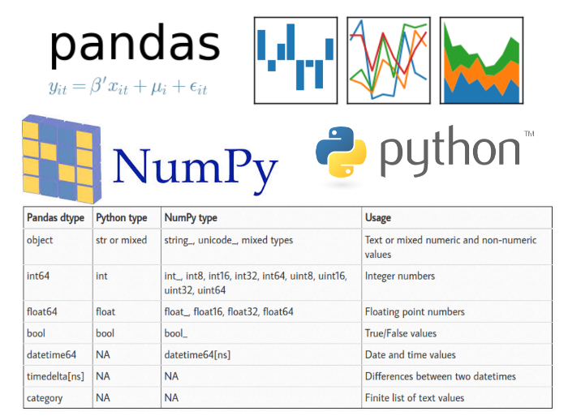
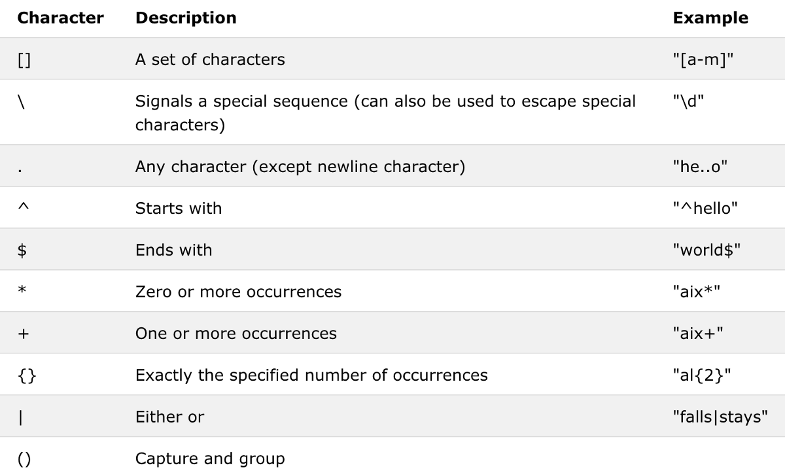
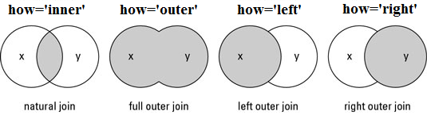

# Pandas II.
## Adattipus specifikus függvények
A `dtypes` tulajdonság megmutatja, hogy melyik oszlopban milyen adattípus található. Fontos adalék, hogy amikor beolvassuk az adatokat, akkor a Pandas az első néhány sor alapján eldönti, hogy milyen adattípus van az oszlopban (egy oszlop egy típus). Ez sokszor vezethet hibákhoz a beolvasásnál, vagy pl. előfordul, hogy számok szövegként vannak tárolva.
```python
import pandas as pd
df = pd.read_csv('source/olimpia.csv')

display(df.head())
display(df.dtypes)
```

Az általános függvény az adattípus megváltoztatására az `astype()` függvény.
```python
import pandas as pd
df = pd.read_csv('source/olimpia.csv')

df['Year'].astype('int')
```
```
0         1992
1         2012
2         1920
3         1900
4         1988
          ... 
271111    1976
271112    2014
271113    2014
271114    1998
271115    2002
Name: Year, Length: 271116, dtype: int32
```
### Dátum típus
A dátum adatípus speciális kezelést igényel, a lentebbi függvény akkor műdödne jól, ha ÉÉÉÉ-HH-NN ÓÓ:PP:MM formátumban lenne megadva az adat.
```python
import pandas as pd
df = pd.read_csv('source/olimpia.csv')

df['Year'].astype('datetime64[s]')
```
```
0        1970-01-01 00:33:12
1        1970-01-01 00:33:32
2        1970-01-01 00:32:00
3        1970-01-01 00:31:40
4        1970-01-01 00:33:08
                 ...        
271111   1970-01-01 00:32:56
271112   1970-01-01 00:33:34
271113   1970-01-01 00:33:34
271114   1970-01-01 00:33:18
271115   1970-01-01 00:33:22
Name: Year, Length: 271116, dtype: datetime64[ns]
```
Az eredmény valóban dátum típusú, de a függvény megfelelő konverzió nélkül nem ismerte fel, hogy az adott szám az évet jelölte, ezért a legkisebb egységgel, a századmásodperccel számolt. A Pandas saját konvertálófüggvénye a `to_datetime()`, melyben paraméterként meg tudjuk adni a formátumot is. 
A dárumformátumban megadott adatokból pedig a `dt` utótaggal kinyerhető külön a dátum és az idő rész is, valamint olyan adatok, mint a hét sorszáma (`dt.isocalendar().week`) vagy az, hogy az adott év szökőév-e (`dt.is_leap_year`).
```python
import pandas as pd
df = pd.read_csv('source/olimpia.csv')

df['Year'] = pd.to_datetime(df['Year'], format='%Y')

display(df['Year'])
display(df['Year'].dt.date)
display(df['Year'].dt.time)
display(df['Year'].dt.isocalendar().week)
display(df['Year'].dt.is_leap_year)
```
```
0        1992-01-01
1        2012-01-01
2        1920-01-01
3        1900-01-01
4        1988-01-01
            ...    
271111   1976-01-01
271112   2014-01-01
271113   2014-01-01
271114   1998-01-01
271115   2002-01-01
Name: Year, Length: 271116, dtype: datetime64[ns]

0         1992-01-01
1         2012-01-01
2         1920-01-01
3         1900-01-01
4         1988-01-01
             ...    
271111    1976-01-01
271112    2014-01-01
271113    2014-01-01
271114    1998-01-01
271115    2002-01-01
Name: Year, Length: 271116, dtype: object

0         00:00:00
1         00:00:00
2         00:00:00
3         00:00:00
4         00:00:00
            ...   
271111    00:00:00
271112    00:00:00
271113    00:00:00
271114    00:00:00
271115    00:00:00
Name: Year, Length: 271116, dtype: object

0          1
1         52
2          1
3          1
4         53
          ..
271111     1
271112     1
271113     1
271114     1
271115     1
Name: week, Length: 271116, dtype: UInt32

0          True
1          True
2          True
3         False
4          True
          ...  
271111     True
271112    False
271113    False
271114    False
271115    False
Name: Year, Length: 271116, dtype: bool
```
### Szöveges típus
A szöveges típus utótagja az `str`, amelyre meghívhatunk rengeteg további függvényt. A teljesség igénye nélkül néhány példa:
- `lower()` / `upper()` - a szöveg kis és nagybetűs változatai
- `zfill()` - 0-kal egészíti ki a szöveget. Ez akkor jöhet jól ha pl. unique azonosítót akarunk készíteni
- `startswith()` - segítségével rákereshetünk bizonyos kezdettel rendelkező szövegekre (az eredmény a megfelelő indexek halmaza)
- `contains()` - segítségével rákereshetünk egy szövegrészletet tartalmazó szövegekre (az eredmény a megfelelő indexek halmaza)
```python
import pandas as pd
df = pd.read_csv('source/olimpia.csv')

print('LOWER')
display(df['Event'].str.lower())
print('ZFILL')
display(df['Event'].str.zfill(width=30))
print('STARTSWITH')
display(df.loc[df['Event'].str.startswith('Basket')])
print('CONTAINS')
print(len(df.loc[df['Event'].str.contains('Men')])) # Csak a darabszámot írjuk ki
```
A `contains` függvény képes kezelni úgynevezett reguláris kifejezéseket. A reguláris kifejezés (rövidítve: regexp vagy regex az angol regular expression után) egy olyan, bizonyos szintaktikai szabályok szerint leírt string, amivel meghatározható stringek egy halmaza.

Az ilyen kifejezés valamilyen minta szerinti szöveg keresésére, cseréjére, illetve a szöveges adatok ellenőrzésére használható.

Például egy érvényes (nem feltétlenül még élő személyt jelölő) személyi szám biztosan a következő elemekből áll:
1.  egy 1 és 8 közötti számjegy;
2.  egy szóköz;
3.  19 vagy 20 vagy 21 és még két számjegy (év);
4.  utána
5.  egy 0 és egy 1-9 közötti számjegy vagy
6.  egy 1 és egy 0-2 közötti számjegy (hónap);
7.  egy 0-2 közötti számjegy és egy 0-9 közötti számjegy vagy
8.  egy 3, amit 0 vagy 1 követ (nap)
9.  egy szóköz
10.  és még négy számjegy.

A [pythex](https://pythex.org/) oldalon interaktívan lehet tesztelni a regex kifejezésünk. Az alábbiakban még néhány példa található a speciális regex kifejezésekre.


A következő regex-et is tartalmazó lekérdezésben például egy regex alapján kerestünk (`regex=True`), figyelmen kívül hagytuk a kis és nagybetűket (`case=False`), és csak olyan sorokat választottunk ki, amelyben szerepel "women" és utána a "ball" kifejezés úgy, hogy a kettő között tetszőleges számú másik karakter is lehet.
```python
import pandas as pd
df = pd.read_csv('source/olimpia.csv')

df.loc[df['Event'].str.contains('women.*ball', regex=True, case=False)]
```
A `split()` függvény a Python verziójához hasonlóan a megadott karakter alapján bontja szét a szöveget. Az `expand` paraméterrel egyből az elemeket tartalmazó külön oszlopokba rakja az eredményt.
```python
import pandas as pd
df = pd.read_csv('source/olimpia.csv')

df['Games'].str.split(' ', expand=True)
```

### Szám típus
Pandasban megtalálható a két alap szám típus (`int`, `float`), de ezen túl szofisztikáltabb `numpy` számformátumokat is tud kezelni. Az alap `astype()` funkcióval az a probléma, hogy int konvertálás esetén nem tudja kezelni a hiányzó elemeket. Az ilyen értékeket alapesetben a Pandas `nan` értékkel helyettesíti amely valójában egy `numpy` alapú `np.nan` érték. Amikor kiíratjuk a tálcára, akkor `NaN`-ként jelenik meg egységesen.

```python
import pandas as pd
df = pd.read_csv('source/olimpia.csv')

df['Age'].astype('int')
```
```
---------------------------------------------------------------------------
IntCastingNaNError                        Traceback (most recent call last)
~\AppData\Local\Temp/ipykernel_13808/3409152218.py in <module>
 2 df = pd.read_csv('source/olimpia.csv')
 3 
----> 4  df['Age'].astype('int')

c:\users\dburk\appdata\local\programs\python\python39\lib\site-packages\pandas\core\generic.py in astype(self, dtype, copy, errors)
 5813         else:
 5814             # else, only a single dtype is given
-> 5815  new_data = self._mgr.astype(dtype=dtype, copy=copy, errors=errors)
 5816             return self._constructor(new_data).__finalize__(self, method="astype")
 5817 

c:\users\dburk\appdata\local\programs\python\python39\lib\site-packages\pandas\core\internals\managers.py in astype(self, dtype, copy, errors)
 416 
 417     def astype(self: T, dtype, copy: bool = False, errors: str = "raise") -> T:
--> 418  return self.apply("astype", dtype=dtype, copy=copy, errors=errors)
 419 
 420     def convert(

c:\users\dburk\appdata\local\programs\python\python39\lib\site-packages\pandas\core\internals\managers.py in apply(self, f, align_keys, ignore_failures, **kwargs)
 325                     applied = b.apply(f, **kwargs)
 326                 else:
--> 327  applied = getattr(b, f)(**kwargs)
 328             except (TypeError, NotImplementedError):
 329                 if not ignore_failures:

c:\users\dburk\appdata\local\programs\python\python39\lib\site-packages\pandas\core\internals\blocks.py in astype(self, dtype, copy, errors)
 590         values = self.values
 591 
--> 592  new_values = astype_array_safe(values, dtype, copy=copy, errors=errors)
 593 
 594         new_values = maybe_coerce_values(new_values)

c:\users\dburk\appdata\local\programs\python\python39\lib\site-packages\pandas\core\dtypes\cast.py in astype_array_safe(values, dtype, copy, errors)
 1307 
 1308     try:
-> 1309  new_values = astype_array(values, dtype, copy=copy)
 1310     except (ValueError, TypeError):
 1311         # e.g. astype_nansafe can fail on object-dtype of strings

c:\users\dburk\appdata\local\programs\python\python39\lib\site-packages\pandas\core\dtypes\cast.py in astype_array(values, dtype, copy)
 1255 
 1256     else:
-> 1257  values = astype_nansafe(values, dtype, copy=copy)
 1258 
 1259     # in pandas we don't store numpy str dtypes, so convert to object

c:\users\dburk\appdata\local\programs\python\python39\lib\site-packages\pandas\core\dtypes\cast.py in astype_nansafe(arr, dtype, copy, skipna)
 1166 
 1167     elif np.issubdtype(arr.dtype, np.floating) and np.issubdtype(dtype, np.integer):
-> 1168  return astype_float_to_int_nansafe(arr, dtype, copy)
 1169 
 1170     elif is_object_dtype(arr):

c:\users\dburk\appdata\local\programs\python\python39\lib\site-packages\pandas\core\dtypes\cast.py in astype_float_to_int_nansafe(values, dtype, copy)
 1211     """
 1212     if not np.isfinite(values).all():
-> 1213 raise IntCastingNaNError( 1214             "Cannot convert non-finite values (NA or inf) to integer"
 1215         )

IntCastingNaNError: Cannot convert non-finite values (NA or inf) to integer
```
A korábbról már ismert `isnull()`, vagy `isna()` függvényekkel lehet rákeresni a hiányzó értékekre. Fontos, hogy az `nan` értékek nem fognak megegyezni összehasonlítás esetén.

```python
import pandas as pd
import numpy as np
df = pd.read_csv('source/olimpia.csv')

print(np.nan == np.nan)
df.loc[df['Age'].isna()]
```
A helyes konvertálási mód a `to_numeric()` függvény, amellyel kezelni lehet a hibás értékeket is, egyéb funkciók mellett.
```python
import pandas as pd
df = pd.read_csv('source/olimpia.csv')

pd.to_numeric(df['Age'])
```
```
0         24.0
1         23.0
2         24.0
3         34.0
4         21.0
          ... 
271111    29.0
271112    27.0
271113    27.0
271114    30.0
271115    34.0
Name: Age, Length: 271116, dtype: float64
```
### Kategórikus típus
A kategórikus tipus statisztikai elemzéseknél jön jól illetve memóriát lehet megtakarítani vele. Pl. ilyen formátumban érdemes tárolni a nemet.
```python
import pandas as pd
df = pd.read_csv('source/olimpia.csv')

df['Medal'] = df['Medal'].fillna('Participation').astype('category')
display(df['Medal'])
```
```
0         Participation
1         Participation
2         Participation
3                  Gold
4         Participation
              ...      
271111    Participation
271112    Participation
271113    Participation
271114    Participation
271115    Participation
Name: Medal, Length: 271116, dtype: category
Categories (4, object): ['Bronze', 'Gold', 'Participation', 'Silver']
```
A `cat` utótaggal érhetőek el a speciális kategórikus függvények. A `categories` tulajdonság például megmutatja a létező kategóriákat. Egy kategórikus típus lehet sorba rendezett. Ez alkalmas pl. a nem, kicsit nem, kicsit igen, igen válaszok tárolására.

## Adattáblák átformálása
### Grouping
A `groupby(['csoportosító_oszlopnév')['oszlopnév'].függvény()` szintaktikával lehet egyik oszlop értékei alapján csoportosítani. Jelen esetben az országrövidítések alapján megszámoljuk, hogy hány érték van a `name` oszlopban.
```python
import pandas as pd
df = pd.read_csv('source/olimpia.csv')

df.groupby(['NOC'])['Name'].count()
```
```
NOC
AFG     126
AHO      79
ALB      70
ALG     551
AND     169
       ... 
YEM      32
YMD       5
YUG    2583
ZAM     183
ZIM     311
Name: Name, Length: 230, dtype: int64
```
A kapott eredményre további függvényeket lehet fűzni. Jelen esetben az olimpikonok átlagéletkorát néztük meg majd rendeztük sorba országrövidítésenként.
```python
import pandas as pd
df = pd.read_csv('source/olimpia.csv')

df.groupby(['NOC'])['Age'].mean().sort_values()
```
```
NOC
TUV    20.142857
MHL    20.285714
MDV    20.918367
NFL    21.000000
YEM    21.093750
         ...    
IRL    27.473727
NAM    27.857143
MON    30.047120
CRT          NaN
UNK          NaN
Name: Age, Length: 230, dtype: float64
```
A csoportosítás lehet több oszlop alapján is (egy listaként átadva). A `nunique()` függvény az különböző értékek számát mutatja.
```python
import pandas as pd
df = pd.read_csv('source/olimpia.csv')

df.groupby(['NOC', 'Sex'])['Name'].nunique()
```
```
NOC  Sex
AFG  F         4
     M        99
AHO  F        10
     M        45
ALB  F        16
            ... 
YUG  M      1100
ZAM  F        13
     M       132
ZIM  F        72
     M       124
Name: Name, Length: 452, dtype: int64
```
A `groupby` függvénnyel kombinálható `transform()` függvény nem csak hogy csoportosítja B oszlop értékeit az A oszlop alapján hanem vissza is helyettesíti a kapott értékeket a B oszlopba. Az alábbi példában a sima `mean()` függvény eredménye annyi elemű, ahány ország van. A `transform(mean)` függvény ezzel szemben annyi sort ad eredményül, ahány sor az eredeti, csoportosítás nélküli táblázatban volt, és minden sor mellé odaírja a `mean` által kiszámított értékek közül a megfelelőt.

```python
import pandas as pd
df = pd.read_csv('source/olimpia.csv')

display(df.groupby(['NOC'])['Age'].mean())
display(df.groupby(['NOC'])['Age'].transform('mean'))
```
```
NOC
AFG    23.538462
AHO    26.589744
ALB    25.342857
ALG    24.370642
AND    23.065089
         ...    
YEM    21.093750
YMD    23.600000
YUG    24.745721
ZAM    23.461039
ZIM    25.200647
Name: Age, Length: 230, dtype: float64

0         23.000977
1         23.000977
2         27.351488
3         27.351488
4         26.633870
            ...    
271111    25.683794
271112    25.683794
271113    25.683794
271114    25.683794
271115    25.683794
Name: Age, Length: 271116, dtype: float64
```
A szintén `groupby` után használható `agg()` függvény egy Python szótárat kap bemenetként és segítségével egy sorra több vagy több sorra egy aggregálási módot is meg lehet adni. Az alábbi példában az országrövidítés alapján az életkor oszlopnak nézzük az átlag és medián értékét, a magasság oszlopnak a minimum és maximum értékét, és végül a játékok oszlopra lefuttattunk egy lambda függvényt (erről a függvénytípusról később még lesz szó).
```python
import pandas as pd
df = pd.read_csv('source/olimpia.csv')

df.groupby(['NOC']).agg({
    'Age': ['mean', 'median'], 
    'Height': ['min', 'max'], 
    'Games': lambda x: set(x)})
```
### Transpose
A transpose `T` függvény átlósan tükrözi a táblánkat. Azaz minden sorból oszlop lesz és fordítva.
```python
import pandas as pd
df = pd.read_csv('source/olimpia.csv')

df.T
```
### Pivot tábla
A `pivot_table()` függvény az Excelben megtalálható pivot funkcióhoz hasonlóan pivotálja az adattáblát. Megadható az oszlopok, sorok, értékek és az aggregálási módszer.

```python
import pandas as pd
df = pd.read_csv('source/olimpia.csv')

pivot = pd.pivot_table(df, index=['NOC'], values=['Age','Height', 'Weight'], columns=['Sex'], aggfunc='mean', margins=True)
display(pivot)
```

### Melt
A `melt()` függvény oszlopokból csinál sorokat azáltal, hogy berakja egy oszlopba több oszlop értékét.
```python
import pandas as pd
df = pd.read_csv('source/olimpia.csv')

pd.melt(df, id_vars=['Team'], value_vars=['Medal', 'Games'], var_name='Olmypic team', value_name='Medal Type')
```
### Stack/unstack
Az `un/stack()` függvény demonstrálására létrehozunk egy összetett csoportosítást. A létrejövő tábla többszintű sorindexxel és többszintű oszlopindexxel rendelkezik. Az ilyen multindexek szintjeit csökkenti az `unstack()` függvény jelen esetben a nem sorindexből oszlopindexet csinálunk. A `stack()` ezzel ellentétesen oszlopindexből csinál sorindexet. Ha nem adunk meg neki paramétert akkor a legkülső indexet rakja át.
```python
import pandas as pd
df = pd.read_csv('source/olimpia.csv')

stack_test = df.loc[(df['NOC'] == 'HUN') & 
                    (df['Games'].str.contains('Summer'))] \
               .groupby(['NOC', 'Games', 'Sex']) \
               .agg({'Age':['min','max','mean'], 
                     'Height':['min','max','mean'], 
                     'Weight':['min','max','mean']})
display(stack_test)
display(stack_test.unstack(level='Sex'))
display(stack_test.stack())
```

## Adattáblák összekapcsolása
### Append
Az `append()` függvény egyszerűen az egyik adattábla végéhez hozzáfűzi a megadott adattábla sorait.
```python
import pandas as pd
df = pd.read_csv('source/olimpia.csv')

print(df.shape)
teszt_df = df.append(df)
print(teszt_df.shape)
```
```
(271116, 15)
(542232, 15)
```
Természetesen csak akkor működik, ha mindkét adattáblának ugyanazok az oszlopai. Különböző adattáblák esetén ezért az összefűzés előtt szükség lehet a korábbi transzformációk alkalmazására.
### Concatenate
A `concat()` függvény egy listában található adattáblákat fűz össze vertikálisan (`axis=0`), vagy horizontálisan (`axis=1`). Például, ha először téli/nyári félre osztjuk az olimpiai táblát, akkor utána újra egyesíthetjük.
```python
import pandas as pd
df = pd.read_csv('source/olimpia.csv')

summer = df.loc[df['Games'].str.contains('Summer')]
winter = df.loc[df['Games'].str.contains('Winter')]
pd.concat([summer, winter], axis=0)
```
A példából kiderül, hogy a vertikális összefűzés lényegében az `append` funkció működését reprodukálja. A horizontális opcióval azonban új oszlopokat fűzhetünk a táblánkhoz (de ilyenkor is fontos az illeszkedés, azaz mindkét táblának ugyanannyi sora kell, hogy legyen).
### Merge
A `merge()` függvény két vagy több adattáblát kapcsol össze egy közös érték alapján. A példához készítünk két átmeneti táblát. A `merge` egyrészt a `df1.merge(df2)`, vagy a `pd.merge(df1, df2)` szintaktikával hajtható végre. A jelen esetben a "Games" oszlopon végezzük el az összekapcsolást.
```python
import pandas as pd
df = pd.read_csv('source/olimpia.csv')

summer_1 = summer.groupby(['Games']) \
                 .agg({'NOC': 'nunique', 
                       'Name': 'nunique', 
                       'Age': 'mean', 
                       'Height': 'mean', 
                       'Weight': 'mean'}) \
                 .reset_index() \
                 .sample(15)

summer_2 = summer.groupby(['Games']) \
                 .agg({'Sport': 'nunique', 
                       'City': 'first'}) \
                 .reset_index() \
                 .sample(15)

merged = pd.merge(summer_1, summer_2, on='Games', how='left')

display(summer_1)
display(summer_2)
display(merged)
```
A how paraméter segítségével tudjuk eldönteni, hogy mi legyen az egyik másik vagy mindkét adattáblában megtalálható adatokkal.
> A kifejezések ismerősek lehetnek azok számára, akik használtak már lekérdező nyelveket (SQL).
Hasznos funkció még a különböző oszlopok specifikálára használt left_on és right_on paraméter illetve a suffixes paraméter, amely az olyan oszlopok megkülönböztetésére való, amelyek mindkét táblában szerepelnek.

## Speciális technikák
### List comprehension
A list comprehension egy olyan hasznos Python technika, amely során egy lista elemeit módosítjuk egy soron belül. Lentebb például az adattáblánk oszlopait kisbetűsítjük.
```python
import pandas as pd
df = pd.read_csv('source/olimpia.csv')

[col.lower() for col in df.columns]
```
```
['id',
 'name',
 'sex',
 'age',
 'height',
 'weight',
 'team',
 'noc',
 'games',
 'year',
 'season',
 'city',
 'sport',
 'event',
 'medal']
```
Ez egy hasznos technika ha egy oszlop több elemét egyszerre szeretnénk módosítani egy logika alapján. Az első példában minden értéket megdupláztunk a magasság oszlopban, míg a második esetben már egy komplexebb feltételrendszer alapján jártunk el.
```python
import pandas as pd
df = pd.read_csv('source/olimpia.csv')

df['Height2'] = [x*2 for x in df['Height']]
df['Height3'] = [x*2 if x > 175 else x/2 for x in df['Height']]
df[['Height', 'Height2', 'Height3']].dropna().head(5)
```
A list comprehension segíthet abban, hogy egy többszintű oszlopindex szintjeit egybefűzzük. A lenti kódrészlet a többszintű oszlop elemeit fűzi egybe '_' kifejezéssel. (A korábbi pivot táblából indulunk ki.)
```python
import pandas as pd
df = pd.read_csv('source/olimpia.csv')

pivot = pd.pivot_table(
    df, 
    index=['NOC'], 
    values=['Age','Height', 'Weight'], 
    columns=['Sex'], 
    aggfunc='mean', 
    margins=True)
display(pivot.head()) # Eredeti pivot

pivot.columns = ['_'.join(col).strip() for col in pivot.columns.values]
display(pivot.head()) # Összefűzött pivot
```

## Apply és lambda függvények
Az `apply()` függvény használatával végre tudunk hajtani egy soron vagy az egész táblán egy megfelelő visszatérési értékkel rendelkező függvényt.
```python
import pandas as pd

def osztalyozo(x):
    if x >= 175:
        return 'magas'
    else:
        return 'alacsony'
        
df = pd.read_csv('source/olimpia.csv')

df['Height_cat'] = df['Height'].apply(osztalyozo)
df.head()
```
> Ez a kód egy új oszlopot fűz a táblához.

Az `apply` képes kezelni az úgynevezett lambda függvényeket is. Azokat a függvényeket hívják lambda függvénynek, ahol egyszeri használatra, soron belül definiáljuk a függvényt. Név hiányában később nem lehet rá hivatkozni. Egy lambda függvény szintaktikája a következő: `lambda x: x*2` , ahol `x` az aktuális sort jelölő változó. Úgy működik, mintha a tábla elemein haladó `for` ciklusváltozója lenne.
```python
import pandas as pd
df = pd.read_csv('source/olimpia.csv')

df['Sex_category'] = df['Sex'].apply(lambda x: 'férfi' if x == 'M' else 'nő')
df.sample(5)
```
A példában egy olyan lambda függvényt használunk az `apply`-al, amelyben egy logikai elágazás is van.

### np.where és feltételes adatmódosítás
Ha szeretnénk egy új oszlopot egy meglévő oszlop bizonyos értékei szerint, akkor az egyik módszer, hogy létrehozunk egy új oszlopot egy alapértékkel, és a loc tulajdonsággal kijelöljük egy részét az eredeti oszlopnak. Ha a kijelölés feltétele után vesszővel berakunk egy oszlopnevet akkor csak a kijelölt oszlop leszűrt részénél módosítjuk az adatot.
```python
import pandas as pd
df = pd.read_csv('source/olimpia.csv')

df['teniszező?'] = 'nem'
df.loc[df['Sport'].str.contains('Tennis'), 'teniszező?'] = 'igen'
df.groupby(['teniszező?'])['ID'].count()
```
```
teniszező?
igen      4817
nem     266299
Name: ID, dtype: int64
```
Az `np.where` hasonlóan működik, de itt egy sorban letudjuk az egész módosítást. A szintaktika az `np.where(feltétel, ha True, ha False)`.
```python
import pandas as pd
import numpy as np
df = pd.read_csv('source/olimpia.csv')

df['magyar?'] = np.where(df['NOC'] == 'HUN', 'igen', 'nem')
df.groupby(['magyar?', 'Sex', 'Medal'])['ID'].count()
```
```
magyar?  Sex  Medal 
igen     F    Bronze     103
              Gold        69
              Silver      95
         M    Bronze     268
              Gold       363
              Silver     237
nem      F    Bronze    3668
              Gold      3678
              Silver    3640
         M    Bronze    9256
              Gold      9262
              Silver    9144
Name: ID, dtype: int64
```

## Feladatok
1. Olvasd be a covid.csv fájlt. Nézd meg az első pár sorát és, hogy melyik oszlopnak mi a típusa.
2. Konvertáld át a date oszlopot date típusra. Alakítsd át az iso_code oszlopot kategórikus típusra.
3. Szűrd le az A-val kezdődő országokat. Csoportosítsd ezen országokat népesség alapján. Ellenőrizd, hogy jó népesség számok jöttek-e, ki. Ha nem akkor a csoportosítást után másik aggregálási módot válassz.
4. Hozz létre egy új oszlopot, amely a szöveggé alakított év és hónap értékekből jön létre (pl.: 2021-05). Csoportosítsd az adatokat az újonnan létrejött oszlop és az ország oszlop alapján. Vedd a New_deaths értékek összegét.
5. Készíts egy pivot táblát az így létrejött csoportosításból. A sorok az egyes országok legyen az oszlopok pedig az év_hónap oszlop. A pivot tábla többszintű oszlopindexét lapítsd ki a list comprehension módszer segítségével.
6. Az így létrejött táblához mergeld hozzá az eredeti tábla iso_code értékeit. Figyelj arra, hogy az eredeti tábla minden országból csak egyet tartalmazzon.