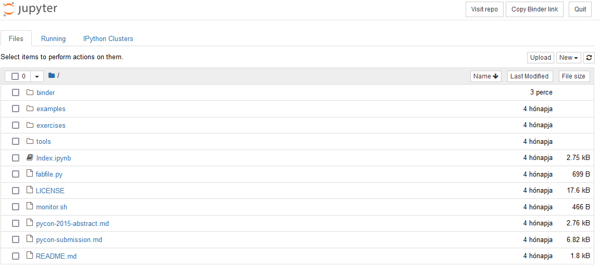

# Jupyter online
Számos fejlesztőkörnyezet és -eszköz érhető el a Python nyelven történő programozáshoz. A választás többnyire preferencia kérdése. A desktop megoldások konfigurációja és kezelése azonban nem triviális, és egy a programozást éppen megismerő személy számára elrettentő és nehezen átlátható lehet. Ezért az alapok elsajátításához érdemes valamilyen online interpretert használni.

Az egyik legelterjedtebb Python környezet a [Jupyter Notebook](https://jupyter.org/try). Az [online](https://mybinder.org/v2/gh/ipython/ipython-in-depth/master?filepath=binder/Index.ipynb) változatának előnyei közé tartozik, hogy regisztráció nélkül is enged fájlokat kezelni. A kurzus során használható az online és a desktop változat is, de a példákban az online változat funkcióit emlegetjük majd, de minden megtalálható a desktop változatban is.

A Jupyter **.ipynb** kiterjesztésű állományokkal dolgozik, és különlegessége, hogy ezekben egymás mellett képes formázott szöveges elemeket ([Markdown](https://www.markdownguide.org/basic-syntax/)) és futtatható Python kódrészleteket kezelni. Mi alapvetően csak kódok futtatására fogjuk használni, de a jellegéből adódóan kiválóan alkalmas jegyzetelésre. 

A Jupyter Notebook elindítását követően a kezdőoldal négy Markdown nyelven írodott szöveges elemből áll, úgynevezett cellákból áll. Ezek a jobb felső sarokban levő gombokkal tetszőlegesen módosíthatók.

A középső legördülő menüben a *Markdown* feliratot *Code*-ra váltva a cella Python kód futtatására alkalmassá változik. Első indításkor érdemes kivágni a felesleges szöveges elemeket és egy új, üres kód cellával indulni. Egy "Hello World!" szöveget megjelenítő példakód megvalósítása így néz ki:

A példában megírtuk a kódunkat és a *Run* gombra kattintva futtattuk. Ekkor az alatta levő sortól kezdődően megjelent a program kimenete, valamint nyílt egy új cella, ahová a következő kódrészletünket írhatjuk.

## Online fájlkezelés
A  ikonra kattintva megnyitható az online fájlkezelő. Itt számos segédanyag és technikai fájl található. A saját fájljaink az ideiglenes `binder` mappában találhatók.

Számunkra csak az .ipynb kiterjesztésű fájlok érdekesek, ezekben tárolhatók futtatható kódrészletek. Alapértelmezésben csak egy *Index.ipynb* fájl található itt. Ez az a fájl, amibe eredetileg dolgoztunk. A jobb oldali *New* gombbal létrehozhatunk újabb fájlokat, de fel is tölthetünk sajátokat az *Upload* gomb segítségével. A kurzus példa feladatainak megoldásait .ipynb kiterjesztésű állományokban töltöttük fel az egyes anyagok végére. Ezeket például érdemes lesz ilyen módon betölteni.

Amennyiben valaki regisztrált az oldalra, vagy a desktop változatot használja, akkor a fájljai bármikor elérhetők. Regisztráció nélküli felhasználás esetén azonban a `binder` csak ideiglenes, és a tartalma kilépés után elveszik. Szerencsére a megnyitást követően a *Download* gomb megnyomásával letölthetők az egyes fájlok, így regisztráció nélkül sem veszik el a munkánk.