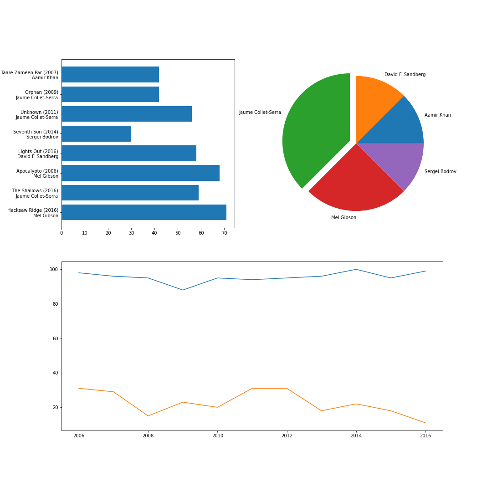

# 3. Minta ZH
A feladat egy összetett ábra generálása a megadott fájlban található IMDB adatsorokból. Egy három alábrából álló ábrát kell összerakni, melynek minden eleméhez más-más módon kell felgyűjteni az adatokat.

A feladatban a legtöbb több részből álló adatszűrési feladat egy sorban is megoldható, de tökéletesen megfelel, ha több sorban, segédváltozókkal oldod meg (akár az eredeti változót többször felülírva).

Ez a ZH sor hosszabb, mint a tényleges számonkérés során várható!

1. Alapadatok
	1. Töltsd le az "imdb.csv" állományt és helyezd el a kód fájlod mellé, majd olvasd be a tartalmát egy `DataFrame`-be a Pandas modul segítségével. A betöltés során gondoskodj róla, hogy az indexek a cím (Title) oszlopból jöjjenek.
	2. Mentsd el egy **directors** nevű változóba a rendezők alábbiak szerint szűrt listáját.
		1. Rendezd az adattáblát a rendezők neve ("Director") szerint.
		2. Kérd le csak a rendezők oszlopát.
		3. Minden rendező csak egyszer szerepeljen a listában.
		4. Vedd a lista minden 140. elemét.
		(Az eredmény 5 rendező neve kell legyen egy listában.)
	3. Hozz létre egy üres ábrát 15x15 inch méretben.

2. Rendezők filmjei
	1. Mentsd el egy **ratings** nevű változóba az adattábla alábbiak szerint szűrt sorait.
		1. Határozd meg azokat a sorokat, amelyeknek a rendezője szerepel a *directors* listában.
		2. Kérd le a meghatározott indexű sorokat az eredeti adattáblából.
	2. Hozd létre egy 2x2-es elrendezésű ábra első elemét, melyre majd egy oszlopdiagram lesz megjelenítve.
	3. A *ratings* felhasználásával állítsd össze az X tengely feliratait az alábbiak szerint.
		1. A felirat eleje a film címe ("Title").
		2. A cím után egy szóközzel következik az év ("Year"). Az összefűzéshez az oszlop lekérdezése után a `.map(str)` függvényt alkalmazva az egészekből álló adatsor karakterláncokból állóvá konvertálható.
		3. Az évet egy sortörés követi, majd a rendező neve ("Director").
	4. Az Y tengely az adott sorok Metascore értékelése ("Metascore") legyen.
	5. Jelenítsd meg az ábrát horizontális oszlopdiagramként (`barh`).

3. Filmek eloszlása
	1. Hozz létre egy üres listát **movies** néven.
	2. Menj végig egy ciklussal a *directors* lista sorain.
	3. A ciklus minden iterációjára végezd el a következőket.
		1. Határozd meg az eredeti tábla azon sorait, melyben a rendező ("Director") oszlop értéke egyezik az éppen a ciklusváltozóban szereplő rendezővel.
		2. Számold meg az így kapott sorokat.
		3. A kapott számot add a *movies* listához.
	4. A ciklus után a *movies* lista felhasználásával hozz létre egy Numpy tömböt, amivel írd felül a *movies* változó értékét.
	5. Hozz létre egy **explode** nevű, egy a *directors* listával egyező számú nullákból álló Numpy tömböt.
	6. Vizsgáld meg, hogy a *movies* tömb melyik elemei egyeznek a *movies* tömb maximális értékével, és írd át az *explode* ezen elemeknek megfelelő értékeit 0.1-re. (A *movies* és az *expand* egyforma hosszú. Ha a *movies* 1. és 3. eleme egyezik a *movies* maximumával, akkor az *expand* 1. és 3. elemének az értékét kell felülírni.)
	7. Hozd létre a 2x2-es ábra második alábráját, melyen jelenítsd meg a *movies* tömb értékeit, és használd a *directors*-t címkéknek. Továbbá emeld ki a legnagyobb érték(ek)et az *explode* tömb segítségével.

4. Éves Metascore-ok alakulása
	1. Mentsd le egy **years** nevű változóba az eredeti adattábla évek ("Year") ÉS Metascore ("Metascore") alapján rendezett változatát.
	2. Írd felül a *years* változó értékét úgy, hogy az eredeti adattartalmából csak azok a sorok kerüljenek bele, amelyek esetén a Metascore értéke nem üres (null). (A tagadáshoz a `~` karaktert kell használni a feltétel előtt.)
	3. Mentsd le egy **best_yearly** nevű változóba a *years* tartalmát úgy, hogy kiszűröd az évek ("Years") szerinti duplikátumokat és mindig az ELSŐ elemeket tartod meg.
	4. Mentsd le egy **worst_yearly** nevű változóba a *years* tartalmát úgy, hogy kiszűröd az évek ("Years") szerinti duplikátumokat és mindig az UTOLSÓ elemeket tartod meg.
	5. Hozd létre a 2x2-es elrendezés alsó sorát kitöltő alábrát.
	6. Az ábrára rajzold ki a *best_yearly* és a *worst_yearly* adathalmazok Metascore értékeit vonaldiagramként. Az X tengely mindkét esetben a különböző évek rendezet listája legyen. (Ezt érdemes a *years*-ből meghatározni, mert az már eleve rendezve van.)
	7. A `show` függvény használatával jelenítsd meg az elkészült ábrát. (Lásd a képet az ellenőrzéshez.)
