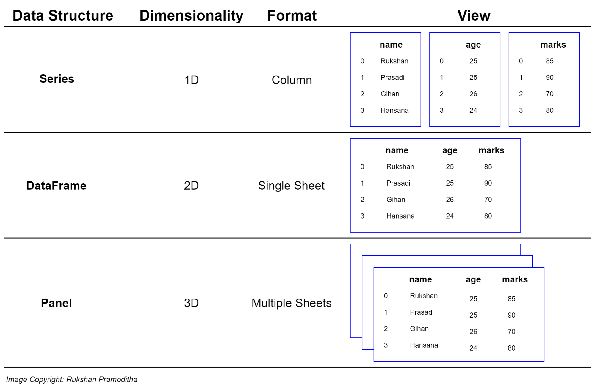
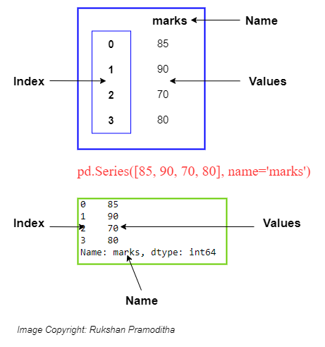
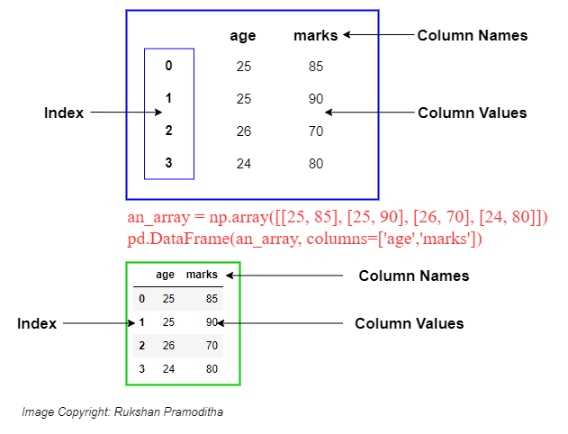

# Pandas
A Pandas egy Python adatkezelő csomag, amely a korábban megismert [NumPy](/content/python_advanced/numpy) csomagra épül.

Telepítés: 
```pip install pandas```
vagy
```conda install pandas```

Szerencsére erre nem lesz szükségünk mivel az Anaconda kiterjesztés már tartalmazza. Az aktuális telepítés verziószáma lekérdezhető a Python-on keresztül.

```python
import pandas as pd
print(pd.__version__)
```
```
1.3.3
```
A [Pandas weboldalán](https://pandas.pydata.org/) számos hasznos leírás érhető el, de érdemes megnézni a beépített dokumentációt is (`pd?`).

## Adatstruktúrák
A Pandas két általunk is sokat használt adatstuktúrája a dataframe (adattábla) és a series (adatsor).


> Érdemes lekérdezni mindkettő dokumentációját (`pd.DataFrame`, `pd.Series`)

### Adatsor
A pandas adatsort (`Series`) egydimenziós adatstruktúrák tárolására találták ki, de belőlük épülnek fel a komplexebb adatstruktúrák is.


A létrehozásuk hagyományos Python listákból kiindulva történik.
```python
import pandas as pd
egy_lista = ['alma', 'körte', 'citrom']
ds = pd.Series(egy_lista)

print(f"Lista:\n{ds}\n")
print(f"Indexek(kulcsok):\n{ds.index}\n")
print(f"Értékek:\n{ds.values}\n")
```
```
Lista:
0      alma
1     körte
2    citrom
dtype: object

Indexek(kulcsok):
RangeIndex(start=0, stop=3, step=1)

Értékek:
['alma' 'körte' 'citrom']
```

A Pandas `index` olyan mint egy háznak a címe (nem csak `Series` esetén). Segítségével tudunk kiválasztani adatpontokat a teljes adatbázisból vagy egy oszlopból. A soroknak és az oszlopoknak is van indexük: a sorok indexe az index, míg az oszlopok indexét az oszlop neve jelenti. Egy jó index csak eltérő értékeket tartalmaz. Ez a legtöbb esetben egy egyesével növekvő számsor, sokszor használnak idősoros indexet is, de tetszőleges értékekkel is felülírhatók.

```python
import pandas as pd
egy_lista = ['alma', 'körte', 'citrom']
index_lista = ['x', 'y', 'z']
ds = pd.Series(egy_lista, index=index_lista)

print(f"Lista:\n{ds}\n")
print(f"Értékek lekérdezése:\n{ds[0]}\n{ds['y']}\n")
```
```
Lista:
x      alma
y     körte
z    citrom
dtype: object

Értékek lekérdezése:
alma
körte
```

### Adattábla
A pandas adattáblák (`DataFrame`) nevesített oszlopokban tárolják az adatokat. 


A struktúrából adódóan az adattáblák létrehozásához egy az egyszerű listánál komplexebb adatszerkezetre van szükség. Az adattábla bemenete egy Python szótár, amiben a megnevezések lesznek az oszlopok nevei, az értékek pedig a megfelelő oszlopok értékeit tartalmazó listák. Fontos kikötés, hogy a listák hossza nem térhet el egymástól.

```python
import pandas as pd

data = {
    'alma': [3, 2, 0, 1], 
    'narancs': [0, 3, 7, 2]
}
df = pd.DataFrame(data)

print(f"Adattábla:\n{df}\n")
print(f"Indexek(kulcsok):\n{df.index}\n")
print(f"Oszlopnevek(mezők):\n{df.columns}\n")
print(f"Értékek:\n{df.values}\n")
print(f"Oszlop lekérdezése:\n{df['alma']}\n")
print(f"Értékek lekérdezése:\n{df['narancs'][2]}\n")
```
```
Adattábla:
   alma  narancs
0     3        0
1     2        3
2     0        7
3     1        2

Indexek(kulcsok):
RangeIndex(start=0, stop=4, step=1)

Oszlopnevek(mezők):
Index(['alma', 'narancs'], dtype='object')

Értékek:
[[3 0]
 [2 3]
 [0 7]
 [1 2]]

Oszlop lekérdezése:
0    3
1    2
2    0
3    1
Name: alma, dtype: int64

Értékek lekérdezése:
7
​```
A fenti példában látható, hogyan lehet lekérdezni az adattábla egyes értékeit. A szerkezetből talán látszik az is, hogy az adattáblákat lényegében nevesített adatsorok alkotják. Bármelyik (akár üres) adattáblához hozzáfűzhetünk egy újabb oszlopot az oszlopnév és az adatsor megadásával.


```python
import pandas as pd

df = pd.DataFrame()
df['alma'] = pd.Series([3, 2, 0, 1])
df['narancs'] = pd.Series([0, 3, 7, 2])
df.index = ['Anna', 'Béla', 'Cecil', 'Dávid']

print(df)
print('\n')
print(df['narancs'])
```
```
       alma  narancs
Anna      3        0
Béla      2        3
Cecil     0        7
Dávid     1        2


Anna     0
Béla     3
Cecil    7
Dávid    2
Name: narancs, dtype: int64
```
A példából látható az is, hogy az adattábla egy közös `index`-et kezel, ami minden benne szereplő adatsor indexét állítja. Egy már a standardtól eltérően indexelt adatsor felülírhatja az eredeti indexelést. Az új sima számokat tartalmazó indexet a reset_index() függvénnyel tudunk létrehozni. Ilyenkor, hacsak egy paraméterben máshogy nem rendelkezünk a régi index oszloppá válik.

```python
import pandas as pd

df = pd.DataFrame()
df['alma'] = pd.Series([3, 2, 0, 1])
df['narancs'] = pd.Series([0, 3, 7, 2])
df.index = ['Anna', 'Béla', 'Cecil', 'Dávid']

print(df)
df = df.reset_index()
print()
print(df)
```
```
       alma  narancs
Anna      3        0
Béla      2        3
Cecil     0        7
Dávid     1        2

   index  alma  narancs
0   Anna     3        0
1   Béla     2        3
2  Cecil     0        7
3  Dávid     1        2
```

Gyakran előfordul az is, hogy egy adattábla egy teljes sorát (adatbázis terminológiával élve: egy rekordját) akarjuk lekérdezni. Ezt a `loc` utasítást használva tehetjük meg. Az `iloc` segítségével akkor is használhatjuk az eredeti sorszám indexet, ha az felül lett írva.

```python
import pandas as pd

df = pd.DataFrame()
df['alma'] = pd.Series([3, 2, 0, 1])
df['narancs'] = pd.Series([0, 3, 7, 2])
print(df.loc[1])

print()
df.index = ['Anna', 'Béla', 'Cecil', 'Dávid']
print(df.loc['Cecil'])
print()
print(df.iloc[1])
print()
print(df.loc['Béla':'Dávid'])
```
```
alma       2
narancs    3
Name: 1, dtype: int64

alma       0
narancs    7
Name: Cecil, dtype: int64

alma       2
narancs    3
Name: Béla, dtype: int64

       alma  narancs
Béla      2        3
Cecil     0        7
Dávid     1        2
```
Mint látható, a sorok lekérdezése során használhatók a listáknál megszokott többszörös kiválasztási lehetőségek is, de itt eltér az intervallumok végének kezelése.

Adattábla létrehozható még a NumPy több dimenziós tömbjei alapján is, de ebben az esetben a táblázatot soronként (rekordonként) és nem oszloponként kell megadnunk.

```python
import pandas as pd
import numpy as np

egy_array = np.array([['Péter', 25, 10, 45], ['Anna', 32, 45, 39], ['Barnabás', 50, 50, 50]])
oszlopok = ['név', 'zh1', 'zh2', 'zh3']

df = pd.DataFrame(egy_array, columns=oszlopok)
print(df)
```
```
        név zh1 zh2 zh3
0     Péter  25  10  45
1      Anna  32  45  39
2  Barnabás  50  50  50
```
## Adattábla létrehozása fájlból
A pandas egyik legnagyobb előnye, hogy képes néhány egyszerű utasítással feldolgozni több különböző táblázatok kezelésére alkalmas forrásállomány tartalmát. Az eredmény minden esetben egy adattábla.

A következő példákhoz a Moodle-ben találhatók a példafájlok. A példák azt feltételezik, hogy a letölthető állományok egy programfájl mellett található `source` nevű mappában találhatók.

```python
import pandas as pd
df = pd.read_csv('source/kosar.csv')
print(df)
```
```
  Unnamed: 0  alma  narancs
0       Anna     3        0
1       Béla     2        3
2      Cecil     0        7
3      Dávid     1        2
```
Az állományok gyakran tartalmaznak kulcs mezőket. A pandas a megfelelő paraméter megadásával képes ezeket kezelni.
```python
import pandas as pd
df = pd.read_csv('source/kosar.csv', index_col=0)
print(df)
```
```
       alma  narancs
Anna      3        0
Béla      2        3
Cecil     0        7
Dávid     1        2
```

Hasonlóan működik a [JSON](https://hu.wikipedia.org/wiki/JSON) állományok feldolgozása is. De ebben az esetben, ha van index oszlop, akkor azt az oszlop neve alapján kell meghatározni.
```python
import pandas as pd
df = pd.read_json('source/kosar.json')
df = df.set_index('index')
print(df)
```
```
       alma  narancs
Anna      3        0
Béla      2        3
Cecil     0        7
Dávid     1        2
```
## Adattábla fájlba írása
Az előző példák tartalma ugyanilyen egyszerűen ki is írható a megfelelő típusú állományokba. Így akár a fájlok konvertálása is egyszerűen megoldható. 
> A példákban az eredményeket egy `target` mappába írjuk, de nem ellenőrizzük, hogy létezik-e. A mappa hiányában az írás hibára fog futni.

```python
import pandas as pd
df = pd.read_json('source/kosar.json')
df = df.set_index('index')
df.to_csv('target/uj_kosar.csv')
```
Természetesen a másik irány is működik.
```python
import pandas as pd
df = pd.read_csv('source/kosar.csv', index_col=0)
df.to_json('target/uj_kosar.json')
```

## Adattábla műveletek
A továbbiakban egy IMDB adatbázis, CSV-ben tárolt adatainak felhasználásával mutatjuk be a pandas modul műveleteit.
```python
import pandas as pd
df = pd.read_csv('source/imdb.csv', index_col='Title')
df
```
Pusztán output-ra írva egy DataFrame-t egy formázott táblát kapunk eredményül. Ha nem csak egy táblázatot akarunk megjeleníteni, akkor a szokásos `print` helyett a `display` függvényt érdemes alkalmazni, melynek hatására ugyanez lesz az eredmény.

### Adattábla alapműveletek
A `head` függvény segítségével könnyen ránézhetünk az adatszerkezetre.  A tábla paraméterként átadott számú sorát adja vissza. (Argumentum hiányában az alapértelmezett érték 5.)
```python
import pandas as pd
df = pd.read_csv('source/imdb.csv', index_col='Title')
df.head()
```
> Ez nagy adattáblák áttekintése esetén hasznos, mert nem próbálja meg a Python feleslegesen vizualizálni az összes adatsort.

Ugyanígy működik a `tail` függvény, de ez az utolsó sorokat adja vissza.
```python
import pandas as pd
df = pd.read_csv('source/imdb.csv', index_col='Title')
df.tail()
```
A `shape` tulajdonság tartalmazza a tábla dimenzióinak méretét.
Az `info` függvény a táblázat adatstruktúrájáról ad egy összegzést.
A `describe` pedig a numerikus változók különböző statisztikai mutatóit írja le.
A `corr` függvény a numerikus értékek egymás közötti korrelációjat mutatja meg.
```python
import pandas as pd
df = pd.read_csv('source/imdb.csv', index_col='Title')
print('SHAPE')
print(df.shape)
print('\nINFO')
print(df.info())
print('\nDESCRIBE')
print(df.describe())
print('\nCORRELATION')
print(df.corr())
```
```
SHAPE
(1000, 11)

INFO
<class 'pandas.core.frame.DataFrame'>
Index: 1000 entries, Guardians of the Galaxy to Nine Lives
Data columns (total 11 columns):
 #   Column              Non-Null Count  Dtype  
---  ------              --------------  -----  
 0   Rank                1000 non-null   int64  
 1   Genre               1000 non-null   object 
 2   Description         1000 non-null   object 
 3   Director            1000 non-null   object 
 4   Actors              1000 non-null   object 
 5   Year                1000 non-null   int64  
 6   Runtime (Minutes)   1000 non-null   int64  
 7   Rating              1000 non-null   float64
 8   Votes               1000 non-null   int64  
 9   Revenue (Millions)  987 non-null    float64
 10  Metascore           977 non-null    float64
dtypes: float64(3), int64(4), object(4)
memory usage: 93.8+ KB
None

DESCRIBE
          Rank     Year  Runtime (Minutes)   Rating        Votes  \
count 1,000.00 1,000.00           1,000.00 1,000.00     1,000.00   
mean    500.50 2,012.78             113.17     6.72   169,808.26   
std     288.82     3.21              18.81     0.95   188,762.65   
min       1.00 2,006.00              66.00     1.90        61.00   
25%     250.75 2,010.00             100.00     6.20    36,309.00   
50%     500.50 2,014.00             111.00     6.80   110,799.00   
75%     750.25 2,016.00             123.00     7.40   239,909.75   
max   1,000.00 2,016.00             191.00     9.00 1,791,916.00   

       Revenue (Millions)  Metascore  
count              987.00     977.00  
mean                72.89      58.85  
std                100.75      17.15  
min                  0.00      11.00  
25%                  3.40      47.00  
50%                 37.43      59.00  
75%                100.10      72.00  
max                936.63     100.00  

CORRELATION
                    Rank  Year  Runtime (Minutes)  Rating  Votes  \
Rank                1.00 -0.26              -0.22   -0.22  -0.28   
Year               -0.26  1.00              -0.16   -0.21  -0.41   
Runtime (Minutes)  -0.22 -0.16               1.00    0.39   0.41   
Rating             -0.22 -0.21               0.39    1.00   0.51   
Votes              -0.28 -0.41               0.41    0.51   1.00   
Revenue (Millions) -0.26 -0.18               0.30    0.25   0.67   
Metascore          -0.17 -0.09               0.21    0.61   0.33   

                    Revenue (Millions)  Metascore  
Rank                             -0.26      -0.17  
Year                             -0.18      -0.09  
Runtime (Minutes)                 0.30       0.21  
Rating                            0.25       0.61  
Votes                             0.67       0.33  
Revenue (Millions)                1.00       0.16  
Metascore                         0.16       1.00
```
Lehetőség van továbbá arra, hogy egyszerűen eltávolítsuk a felesleges, ismétlődő sorokat.
```python
import pandas as pd
df = pd.read_csv('source/imdb.csv', index_col='Title')
teszt_df = df.drop_duplicates()
teszt_df.shape
```
```
(1000, 11)
```
### Adattábla paraméteres függvényei
Az előző példában nem történt semmi mert nem voltak egyező sorok. A továbbiakban lemásoljuk az adattáblánkat a `copy` függvény segítségével. Ezen túl a `drop_duplicates` függvény lehetővé teszi különböző paraméterek használatát. Ezen függvény esetében ilyen:
- `subset`, amely azt jelenti, hogy csak egy bizonyos oszlopra vonatkozik a duplikáció keresés
- `keep`, amellyel specifikálni lehet, hogy melyik értéket tartsa meg
- `inplace`, amely nagyon sok függvényben elérhető és változó deklarálás nélkül az eltárolt objektumot módosítja

```python
import pandas as pd
df = pd.read_csv('source/imdb.csv', index_col='Title')

teszt_df = df.copy()
teszt_df.drop_duplicates(inplace=True, keep='last', subset=['Year'])
print(teszt_df.shape)
teszt_df
```
A `sort_values` függvény sorbarendezi az adattábla sorait (alapesetben az index alapján). Újdonság még a lentebbi kódban, hogy a különböző függvényeket egymásra lehet fűzni, ahol balról jobbra haladva minden függvény bemeneti változója az előző függvény eredménye.

```python
import pandas as pd
df = pd.read_csv('source/imdb.csv', index_col='Title')

df.sort_values(by='Rating', ascending=False).head(5)
```

Oszlopok átnevezése és kisbetűssé tétele.
```python
import pandas as pd
df = pd.read_csv('source/imdb.csv', index_col='Title')

df.rename(columns={'Runtime (Minutes)': 'Runtime', 
                    'Revenue (Millions)': 'Revenue_millions'}, 
           inplace=True)
df.columns = df.columns.str.lower()
print(df.columns)
```
```
Index(['rank', 'genre', 'description', 'director', 'actors', 'year', 'runtime',
       'rating', 'votes', 'revenue_millions', 'metascore'],
      dtype='object')
```
### Oszlopok törlése
```python
import pandas as pd
df = pd.read_csv('source/imdb.csv', index_col='Title')

print(df.columns)
df = df.drop(columns=['Rank'])
print(df.columns)
```
```
Index(['Rank', 'Genre', 'Description', 'Director', 'Actors', 'Year',
       'Runtime (Minutes)', 'Rating', 'Votes', 'Revenue (Millions)',
       'Metascore'],
      dtype='object')
Index(['Genre', 'Description', 'Director', 'Actors', 'Year',
       'Runtime (Minutes)', 'Rating', 'Votes', 'Revenue (Millions)',
       'Metascore'],
      dtype='object')
```
### Üres értékek listázása
Az `isnull` függvény megmutatja, hogy melyik érték hiányos.
A `sum` függvény összeszámolja az előbbiekben kimutatott adathiányokat: a False = 0 és True = 1.
A `dropna` függvénnyel eldobjuk azokat a sorok, ahol üres érték van.
```python
import pandas as pd
df = pd.read_csv('source/imdb.csv', index_col='Title')

display(df.isnull())
display(df.isnull().sum())
display(df.dropna().isnull().sum())
```

## Oszlopok/adatsorok műveletei
A `dataframe['oszlopnév']` szintaktikával tudunk kijelölni egy oszlopot. Így egy Pandas adatsort kapunk. Ezzel szemben a `dataframe[['oszlopnév']]` szintaktikával egy (vagy több oszlopra) szűkítjük le az adattáblát, de a formátuma adattábla marad.
```python
import pandas as pd
df = pd.read_csv('source/imdb.csv', index_col='Title')

display(df['Rating'])
display(df[['Rating']])
```
A `unique` függvény kilistázza a adott oszlop értékkészletét.
A `max` és `min` függvény a legnagyobb és a legkisebb értéket mutatja meg.
Az `idxmax` és `idxmin` függvény pedig az ezen értékekhez tartozó indexet mutatja meg.
A `sum`, `median`, `mean` és stb. függvények értelemszerűen listázzák a megfelelő értéket
A `quantile` függvény a q paraméternél megadott százalékos kvantilist mutatja meg. Pl. q=.2 -> 20%
```python
import pandas as pd
df = pd.read_csv('source/imdb.csv', index_col='Title')

print(df['Rating'].unique())
print(df['Rating'].max())
print(df['Rating'].min())
print(df['Rating'].idxmax())
print(df['Rating'].idxmin())
print(df['Revenue (Millions)'].sum())
print(df['Year'].median())
print(df['Year'].mean())
print(df['Year'].quantile(q=.2))
```
```
[8.1 7.  7.3 7.2 6.2 6.1 8.3 6.4 7.1 7.5 7.8 7.9 7.7 6.6 8.2 6.7 8.  6.5
 5.3 6.8 4.7 5.9 6.3 5.6 8.6 7.6 6.9 2.7 3.7 5.8 9.  7.4 4.1 8.5 8.8 5.4
 6.  5.7 8.4 5.2 5.5 4.8 3.9 4.9 5.1 5.  4.3 4.6 4.2 4.  3.2 4.5 1.9 3.5
 4.4]
9.0
1.9
The Dark Knight
Disaster Movie
71938.31999999999
2014.0
2012.783
2009.8
```
Az alábbi kód a bevétel átlagát helyettesíti be a `fillna` függvény segítségével a hiányzó értékek helyett.
```python
import pandas as pd
df = pd.read_csv('source/imdb.csv', index_col='Title')

bevetel = df['Revenue (Millions)']
bevetel_atlag = bevetel.mean()
print(bevetel_atlag)
bevetel.fillna(bevetel_atlag, inplace=True)
display(bevetel)
```
```
72.88583586626139

Title
Guardians of the Galaxy   333.13
Prometheus                126.46
Split                     138.12
Sing                      270.32
Suicide Squad             325.02
                           ...  
Secret in Their Eyes        0.00
Hostel: Part II            17.54
Step Up 2: The Streets     58.01
Search Party                0.00
Nine Lives                 19.64
Name: Revenue (Millions), Length: 1000, dtype: float64
```

Míg a korábbi függvények csak numerikus oszlopokra vonatkoztak, addig a `value_counts` bármilyen oszlop esetében listázza leggyakoribb értékeket.
```python
import pandas as pd
df = pd.read_csv('source/imdb.csv', index_col='Title')
display(df['Genre'].value_counts().head(3))
```
```
Action,Adventure,Sci-Fi    50
Drama                      48
Comedy,Drama,Romance       35
Name: Genre, dtype: int64
```

Oszlopokkal különböző műveleteket lehet végezni. Itt pl. kiszámoljuk, hogy mennyi bevétel jutott a filmek egy percére. De numerikus oszlopokhoz hasonlóan a szöveges oszlopokat is lehet kombinálni.
```python
import pandas as pd
df = pd.read_csv('source/imdb.csv', index_col='Title')
display(df['Revenue (Millions)'] / df['Runtime (Minutes)'])
```
```
Title
Guardians of the Galaxy   2.75
Prometheus                1.02
Split                     1.18
Sing                      2.50
Suicide Squad             2.64
                          ... 
Secret in Their Eyes      0.00
Hostel: Part II           0.19
Step Up 2: The Streets    0.59
Search Party              0.00
Nine Lives                0.23
Length: 1000, dtype: float64
```

## Értékek kiválasztása feltételekkel
Bizonyos feltételek/kondiciók alapján leszűrhetjük az adatunkat. A feltétel a háttérben minden adatra megnézi, hogy igaz, vagy hamis az állítás. A `loc` tulajdonsággal kombinálva pedig leszűrhetjük az adattáblát.
```python
import pandas as pd
df = pd.read_csv('source/imdb.csv', index_col='Title')
kondicio = (df['Director'] == 'James Gunn')
display(kondicio.head())

display(df.loc[kondicio])
```
```
Title
Guardians of the Galaxy     True
Prometheus                 False
Split                      False
Sing                       False
Suicide Squad              False
Name: Director, dtype: bool
```

A feltétel lehet numerikus és kisebb/nagyobb is, de összefűzhetünk több feltételt a VAGY (`|`) és ÉS (`&`) operátorokkal, valamint megfelelő zárójelezéssel. A `df['oszlopnév'].isin(egy_lista)` függvényével szűrhetünk azokra az értékekre, amelyek szerepelnek az `egy_lista`-ban. Alább egy többszörösen összetett feltételrendszert látni. A formázás segít megmutatni, hogy melyik zárójel hova tartozik.
```python
import pandas as pd
df = pd.read_csv('source/imdb.csv', index_col='Title')
df.loc[((df['Year'] >= 2010) & 
        (df['Year'] <= 2015)) & 
        (df['Rating'] > 8.0) & 
        (df['Revenue (Millions)'] < df['Revenue (Millions)'].quantile(0.25))]
```
## Feladatok
1. Olvasd be a szeged.csv fájlt. Nézd meg az első pár sorát, a teljes adatbázis méretét, írasd ki a leíró statisztikákat és a korrelációt az oszlopok között.
2. Töröld a "Loud Cover" és "Daily Summary" oszlopokat. Nevezd át a maradék oszlopokat úgy, hogy mindegyik kisbetűs és _-al legyenek elválasztva szavak
3. Nézd meg melyik napon volt a legnagyobb a láthatóság? Mi volt az átlagos páratartalom? Melyik nap volt a legnagyobb különbség a hőmérséklet és a hőérzet között?
4. Hány olyan sor van ahol hó esett, a leírás alapján ködös idő volt és vagy 0 és 20 méter között volt a láthatóság vagy 3.2 km felett volt a láthatóság, de a páratartalom 0.9 alatt volt?